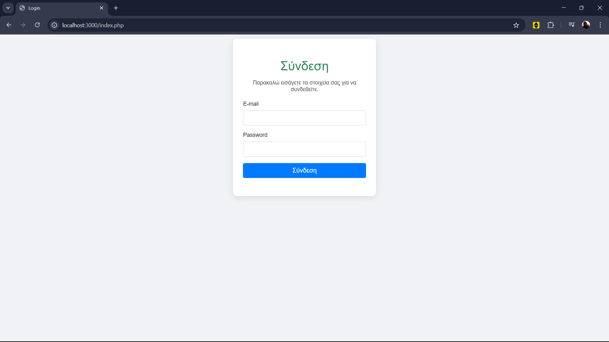
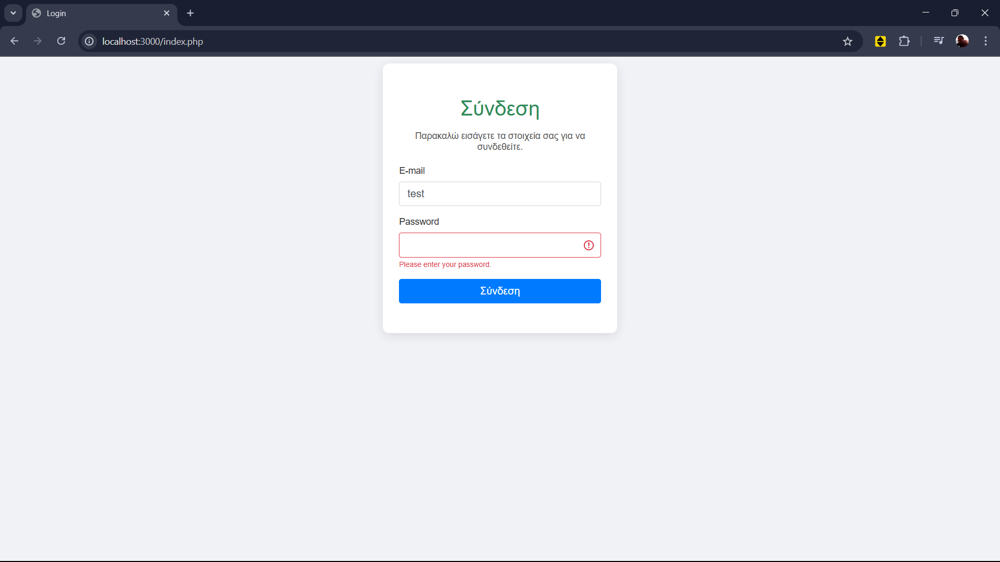
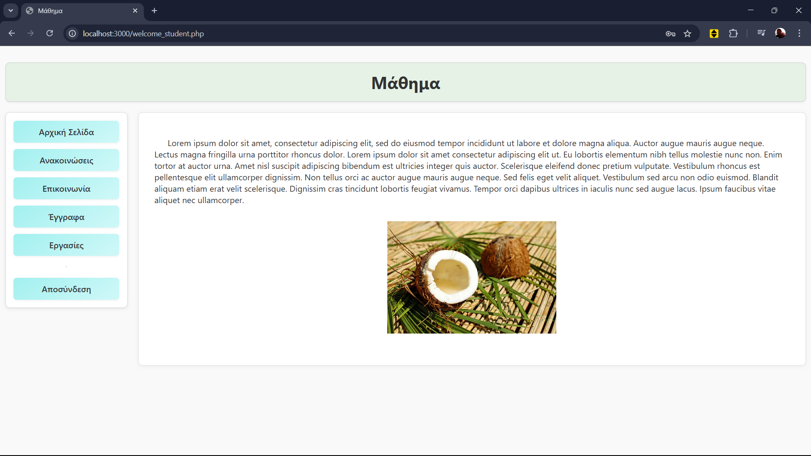
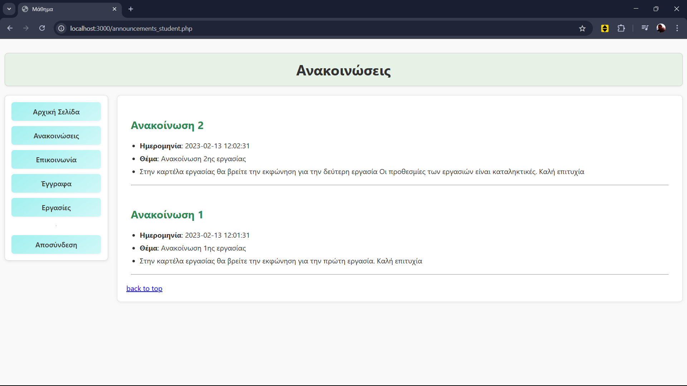
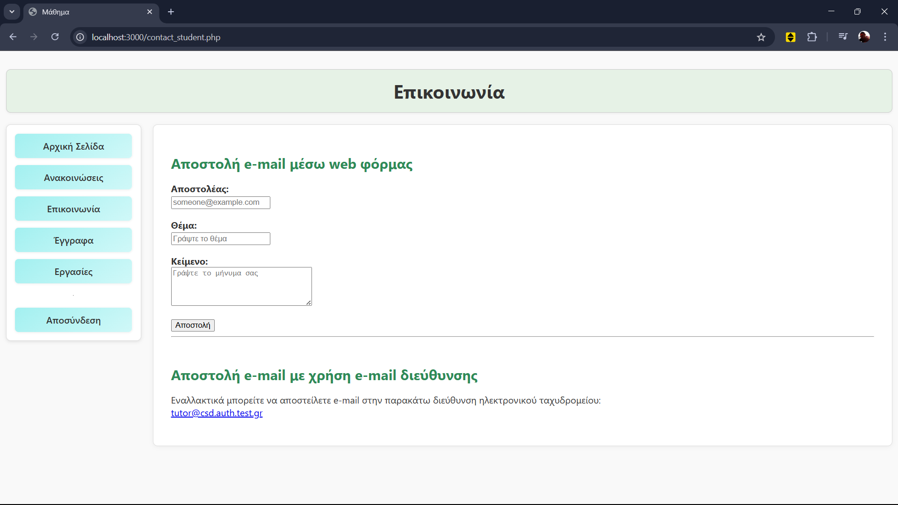
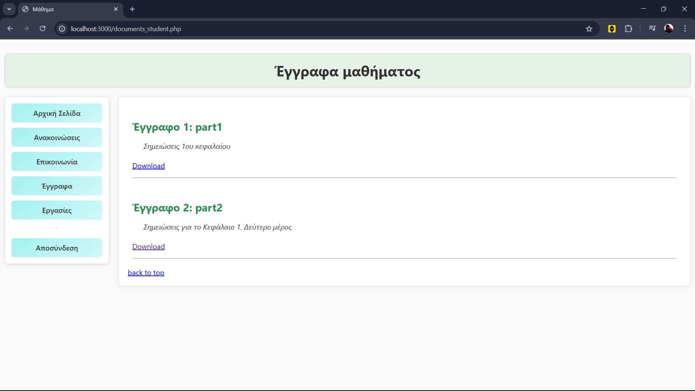
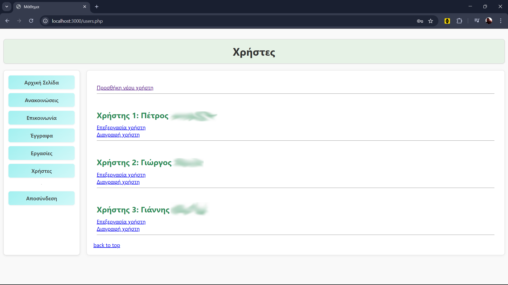
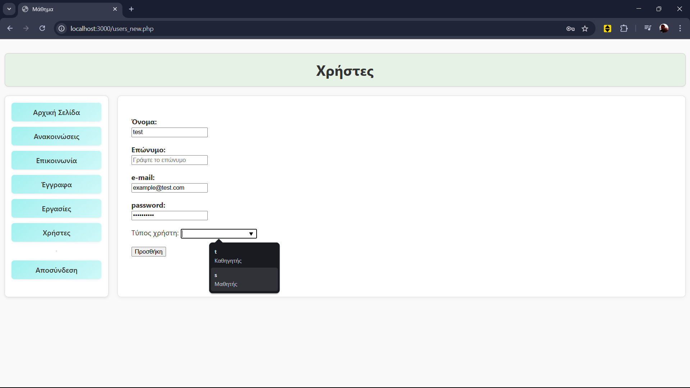

# 📚 eClass Web App (University Project)

A lightweight PHP-based eClass-style website developed for the course _“Εκπαιδευτικά Περιβάλλοντα Διαδικτύου”_ (Educational Web Environments).  
This project simulates a simple course management platform with two distinct user roles: **Students** and **Teachers**.

> 🧪 This was created as part of a university assignment and is intended for portfolio purposes.

---

## 🔍 Features

- 🔐 Session-based login system with role-based redirects

- 🧑‍🎓 **Student View**
  - Login and access protected content
  - View announcements
  - Download course materials and assignments
  - Contact teacher form

- 👩‍🏫 **Teacher View**
  - Full access to manage announcements, documents, and assignments
  - Dedicated **Users** tab for managing student accounts
  - Add / Edit / Remove users
  - Review student messages in contact tab

- 📁 Side navigation bar with:
  - Home
  - Announcements
  - Contact
  - Documents
  - Assignments
  - Logout
  - *(+ Users tab for teachers)*

---

## ⚙️ Tech Stack

- 🐘 PHP (Procedural)
- 🐬 MySQL
- 🧼 Pure CSS for styling
- 🎨 Fully responsive layout with Flexbox

---

## 📸 Screenshots

### Login
- 
- 

### Student View
- 
- 
- 
- 
- 

### Teacher View
- 
- 

---

## 🚫 Ignored Files

- `/files/` and `/img/` folders are excluded from the repo (handled via `.gitignore`)
- These typically include student-uploaded content or course assets

---

## 📌 Notes

- This is a simple, non-production system meant to demonstrate backend logic and UI structure.
- Adjusted for portfolio showcasing.

---
